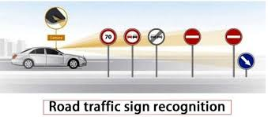

# Traffic Signs🚦 Detection

In this era of Artificial Intelligence, humans are becoming more dependent on technology. With the enhanced technology, multinational companies like Google, Tesla, Uber, Ford, Audi, Toyota, Mercedes-Benz, and many more are working on automating vehicles. They are trying to make more accurate autonomous or driverless vehicles. You all might know about self-driving cars, where the vehicle itself behaves like a driver and does not need any human guidance to run on the road. This is not wrong to think about the safety aspects—a chance of significant accidents from machines. But no machines are more accurate than humans. Researchers are running many algorithms to ensure 100% road safety and accuracy.

# Dataset link:- https://www.kaggle.com/datasets/meowmeowmeowmeowmeow/gtsrb-german-traffic-sign

